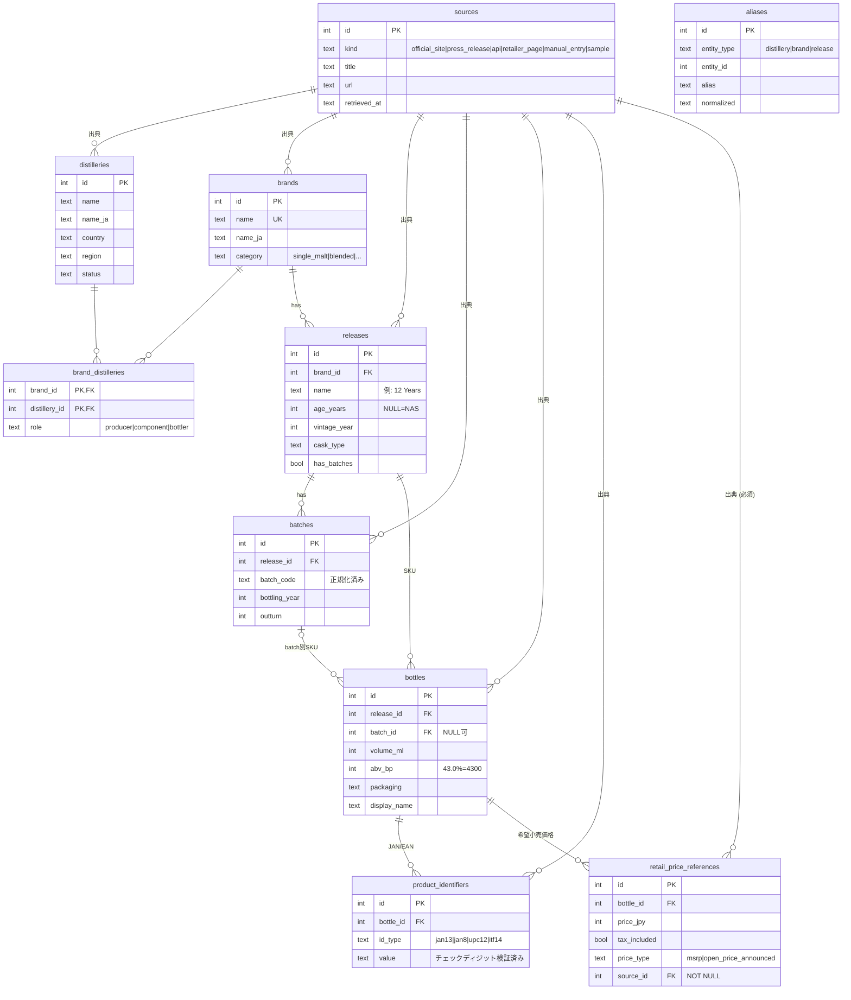
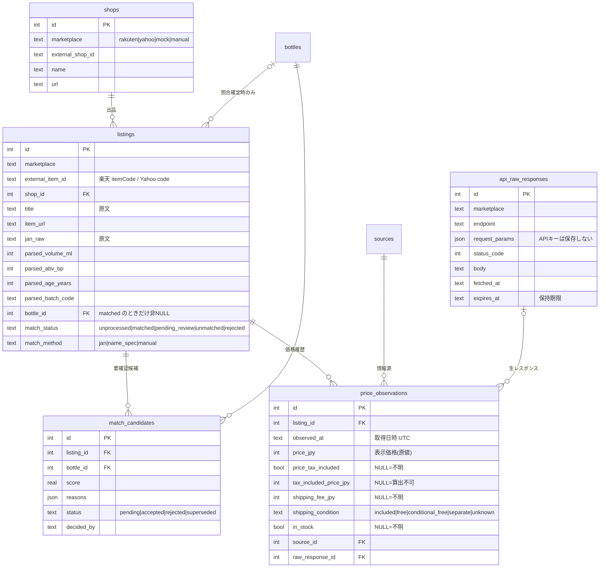
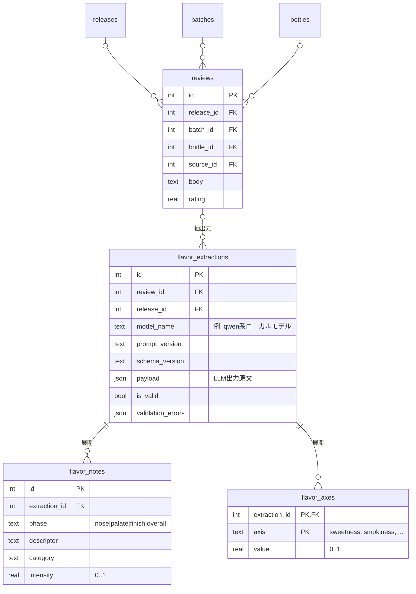

# ER図

GitHub 上では Mermaid として描画されます。カラムは主要なものだけ載せています（全定義は `src/whisky_ai/migrations/0001_initial.sql`）。

## 1. 商品マスター（蒸留所 → 銘柄 → リリース → バッチ → ボトル）

```mermaid
erDiagram
    sources ||--o{ distilleries : "出典"
    sources ||--o{ brands : "出典"
    sources ||--o{ releases : "出典"
    sources ||--o{ batches : "出典"
    sources ||--o{ bottles : "出典"
    sources ||--o{ product_identifiers : "出典"
    sources ||--o{ retail_price_references : "出典 (必須)"

    distilleries ||--o{ brand_distilleries : ""
    brands ||--o{ brand_distilleries : ""
    brands ||--o{ releases : "has"
    releases ||--o{ batches : "has"
    releases ||--o{ bottles : "SKU"
    batches |o--o{ bottles : "batch別SKU"
    bottles ||--o{ product_identifiers : "JAN/EAN"
    bottles ||--o{ retail_price_references : "希望小売価格"

    sources {
        int id PK
        text kind "official_site|press_release|api|retailer_page|manual_entry|sample"
        text title
        text url
        text retrieved_at
    }
    distilleries {
        int id PK
        text name
        text name_ja
        text country
        text region
        text status
    }
    brands {
        int id PK
        text name UK
        text name_ja
        text category "single_malt|blended|..."
    }
    brand_distilleries {
        int brand_id PK,FK
        int distillery_id PK,FK
        text role "producer|component|bottler"
    }
    releases {
        int id PK
        int brand_id FK
        text name "例: 12 Years"
        int age_years "NULL=NAS"
        int vintage_year
        text cask_type
        bool has_batches
    }
    batches {
        int id PK
        int release_id FK
        text batch_code "正規化済み"
        int bottling_year
        int outturn
    }
    bottles {
        int id PK
        int release_id FK
        int batch_id FK "NULL可"
        int volume_ml
        int abv_bp "43.0%=4300"
        text packaging
        text display_name
    }
    product_identifiers {
        int id PK
        int bottle_id FK
        text id_type "jan13|jan8|upc12|itf14"
        text value "チェックディジット検証済み"
    }
    retail_price_references {
        int id PK
        int bottle_id FK
        int price_jpy
        bool tax_included
        text price_type "msrp|open_price_announced"
        int source_id FK "NOT NULL"
    }
    aliases {
        int id PK
        text entity_type "distillery|brand|release"
        int entity_id
        text alias
        text normalized
    }
```

## 2. 販売商品・照合・価格履歴

```mermaid
erDiagram
    shops ||--o{ listings : "出品"
    bottles |o--o{ listings : "照合確定時のみ"
    listings ||--o{ match_candidates : "要確認候補"
    bottles ||--o{ match_candidates : ""
    listings ||--o{ price_observations : "価格履歴"
    sources ||--o{ price_observations : "情報源"
    api_raw_responses |o--o{ price_observations : "生レスポンス"

    shops {
        int id PK
        text marketplace "rakuten|yahoo|mock|manual"
        text external_shop_id
        text name
        text url
    }
    listings {
        int id PK
        text marketplace
        text external_item_id "楽天 itemCode / Yahoo code"
        int shop_id FK
        text title "原文"
        text item_url
        text jan_raw "原文"
        int parsed_volume_ml
        int parsed_abv_bp
        int parsed_age_years
        text parsed_batch_code
        int bottle_id FK "matched のときだけ非NULL"
        text match_status "unprocessed|matched|pending_review|unmatched|rejected"
        text match_method "jan|name_spec|manual"
    }
    match_candidates {
        int id PK
        int listing_id FK
        int bottle_id FK
        real score
        json reasons
        text status "pending|accepted|rejected|superseded"
        text decided_by
    }
    price_observations {
        int id PK
        int listing_id FK
        text observed_at "取得日時 UTC"
        int price_jpy "表示価格(原値)"
        bool price_tax_included "NULL=不明"
        int tax_included_price_jpy "NULL=算出不可"
        int shipping_fee_jpy "NULL=不明"
        text shipping_condition "included|free|conditional_free|separate|unknown"
        bool in_stock "NULL=不明"
        int source_id FK
        int raw_response_id FK
    }
    api_raw_responses {
        int id PK
        text marketplace
        text endpoint
        json request_params "APIキーは保存しない"
        int status_code
        text body
        text fetched_at
        text expires_at "保持期限"
    }
```

## 3. レビュー・香味特徴（LLM 抽出）

```mermaid
erDiagram
    releases |o--o{ reviews : ""
    batches |o--o{ reviews : ""
    bottles |o--o{ reviews : ""
    reviews |o--o{ flavor_extractions : "抽出元"
    flavor_extractions ||--o{ flavor_notes : "展開"
    flavor_extractions ||--o{ flavor_axes : "展開"

    reviews {
        int id PK
        int release_id FK
        int batch_id FK
        int bottle_id FK
        int source_id FK
        text body
        real rating
    }
    flavor_extractions {
        int id PK
        int review_id FK
        int release_id FK
        text model_name "例: qwen系ローカルモデル"
        text prompt_version
        text schema_version
        json payload "LLM出力原文"
        bool is_valid
        json validation_errors
    }
    flavor_notes {
        int id PK
        int extraction_id FK
        text phase "nose|palate|finish|overall"
        text descriptor
        text category
        real intensity "0..1"
    }
    flavor_axes {
        int extraction_id PK,FK
        text axis PK "sweetness, smokiness, ..."
        real value "0..1"
    }
```
